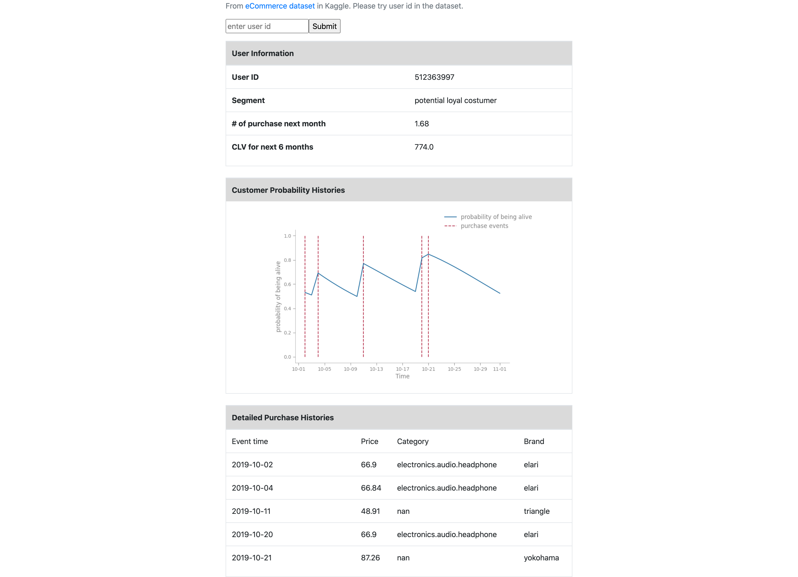

# User Profile Searching Tool [(link)](https://user-search-siwei.herokuapp.com/)

#### by [Siwei Ma](https://www.linkedin.com/in/siwei-ma-28345856/)

Figure. Screencapture of the user profile searching tool.

# Data Summary
The data of this project came from [eCommerce behavior dataset] (https://www.kaggle.com/mkechinov/ecommerce-behavior-data-from-multi-category-store?select=2019-Oct.csv) in Kaggle.

# Executive Summary
The tool aims to help people, especially those who deal directly with customers, to know their customers faster and better. The tool provides the information such as the customer's segement/clustering, CLV, conditional expected number of purchase for next month, the probability of customer of being alive, detailed purchase history. 

# Process
## Data preprocessing
The raw data (13.67 GB) includes 100 million event records. The user in this project was described in three dimensions: recency, frequency, and monetary (RFM). These information was calculated and queried by SQL. Just like the other metrics, there are quite a few ways to calculate them. In this project, I used the following defination:

recency: the duration between customer's first and last purchase
frequency: the count of repeated purchases. If the customer made several purchases in one day, we consider it as one purchase
monetary: the sum of repeated purchases for each day dived by the total days when purchases occurred.

## User segmentation
I clustered the customers based on RFM information. There are several clustering algorithms used: k-means/k-means++, random forest clustering and spectral clustering. As for k-means/k-means++, random forest clustering algorithms, they were implemented by Python from scratch. As the part of these code is from homework and I am not allowed to publish them in public - please contact me if you are interested.

The customers have been clustered as 6 groups. After analyzing each group's RFM ditribution, I labeled them as loyal customer, potential loyal customer, dormant customer, and so on. 

## Prediction on CLV, number of purchase, and alive probability
The number of transitions is calculated by BG/NBD model. BG/NBD is a probabilistic model which assumes the number of transitions follows a Poisson distribution while the number of transition after which customer churns follows geometric distribution. The parameter λ in Poisson ditribution was controlled by gamma distribution while the probability in geometric distribution was controlled by beta distribution. I personally think the reason that gamma and bata distributions are selected is that they are conjugate prior of Poisson and geometric distributions respectively. Then a likelihood function was constructed given customer's purchase history. By maximize the likelihood function, we can get all parameters in gamma and beta distributions. Thus, we can predict the future number of transitions/purchases. More calculation details in the [paper](http://brucehardie.com/papers/018/fader_et_al_mksc_05.pdf). With the number of transitions, we can go ahead to calculate average CLV of the customers by taking average profit into consideration. 

The awesome package [lifetimes](https://lifetimes.readthedocs.io/en/latest/) was used for the above calculations. 

# Web App
The web application was made using Flask and deployed to Heroku.

